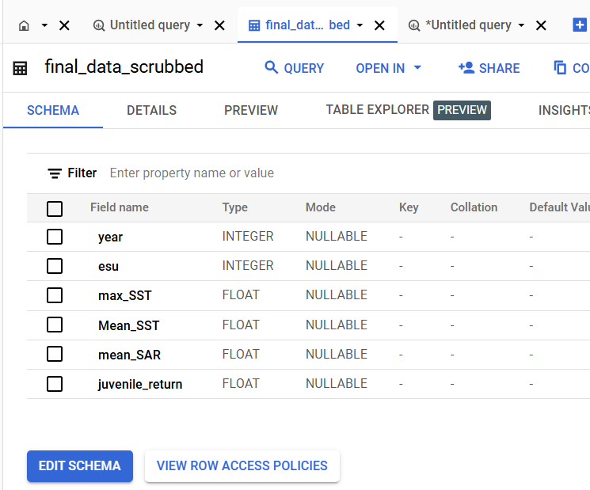

```{r setup, include=FALSE}
knitr::opts_chunk$set(echo = TRUE)
knitr::opts_knit$set(root.dir = "C:\\Users\\ander\\OneDrive - Oregon State University\\Classes\\2025\\Winter\\CS512\\HW\\Final Project") # sets root directory for the knitting process
setwd("C:\\Users\\ander\\OneDrive - Oregon State University\\Classes\\2025\\Winter\\CS512\\HW\\Final Project") # sets the working directory for code chunks

# packages
library(ggplot2)
library(tidyr)
library(knitr)
library(broom)
library(backports)
library(faraway)
library(MASS)
library(reshape)
library(ggExtra)
library(broom)
library(car)
library(dplyr)
library(reticulate)
```

```{r}
# load in data
# unscrubbed data
fish_data <- read.csv("fish_data.csv")
# climatic_data <- read.csv("climatic_variables_datapull.csv")
# storm_data <- read.csv("combined_storm_events.csv")

# post dataprep data
dataprep_data <- read.csv("final_data_post_dataprep.csv")
```

```{r}
# scrubbed data
final_data <- read.csv("imputed_dataset.csv")
```

## Nexus Project:

Decreases in fish stocks have cultural, social, economic, and environmental impacts throughout the western United States. Tracking changes in fish stocks provides vital data for the conservation and protection of this declining resource. As part of fish stock management, various state and federal agencies monitor oceanic and river conditions to determine catch limits. The National Oceanic and Atmospheric Administration (NOAA) cites eight ocean indicators critical for monitoring the health of salmon fish stocks along the western United States.

Our previous studies used one of these ocean indicators, sea surface temperatures (SST), and examined its influence on the smolt-to-adult return ratio (SAR) of an important group of salmonids: the Upper Columbia spring-run Chinook salmon. It was found that while significant relationships were present, our analyses had low statistical power. This study expands the timeframes by splitting the data by the year in which our ESU received critical habitat designation (September, 2005), creating a before and after designation time period. These two time periods are then investigated by collecting mean SAR and juvenile returns for our ESU and the explanatory variables of mean SST and max SST for the California Current between 1994 and 2024. Explanatory variables of copepod species richness and eutrophication due to flooding events along the coastal range of the California Current were investigated but reserved for another study given additional time for data processing. (1)

## Mid Term Project:

Further study is needed to address several key questions in this
project. Specifically, we aim to determine: 1. Is there a significant
difference in the mean Smolt to Adult Return (SAR) and Chinook Juvenile
catches between the pre and post listing periods of critical habitat for
the Spring-run, Upper Columbia Basin Chinook Salmon? 2. Is there a
significant difference in environmental variables such as mean Sea
Surface Temperature (meanSST), maximum Sea Surface Temperature (maxSST),
Pacific Decadal Oscillation (PDO) from May to September, and Copepod
species richness between the pre and post listing periods? 3. Which
explanatory environmental variables are most important in describing the
null hypothesis $(H_0)$ of no difference in the response variable (Upper
Columbia Basin Chinook Salmon) between the pre and post listing periods
of critical habitat?

## Final Project:

Further study is needed to address several key questions in this project. 
Specifically, we aim to determine: 1. Given an increased temporal range and 
splitting the data by critcal habitat designation, do we see similar 
relationships for the questions above. A. Is there a significant
difference in the mean Smolt to Adult Return (SAR) and Chinook Juvenile
catches between the pre and post listing periods of critical habitat for
the Spring-run, Upper Columbia Basin Chinook Salmon? B. Is there a
significant difference in environmental variables such as mean Sea
Surface Temperature (meanSST), maximum Sea Surface Temperature (maxSST)? 
C. Which eplanatory environmental variables are most important in describing 
the null Hypothesis $(H_0)$ of no difference in the response variable (mean SAR Upper
Columbia Basin Chinook Salmon) between the pre and post listing periods
of critical habitat?

## Obtain:

Fish data: New fish data were pulled from the Columbia Basin Research Center Data Access in Real Time resource hosted by the University of Washington. (2) We utilized the following settings on the API: SAR survival, Bonneville (All) to Bonneville Adult, Chinook Upper Columbia R Spring ESU, All, Exclude 0-Year Adult Detections, by Release Basin, and download Pooled by Year SAR csv. These data were available in CSV format (~4KB).

Display raw fish data:

```{r}
head(fish_data)
```

Climatic data: Additional climatic data were
collected from the Northwest Fisheries Science Center, a Subsidiary of
NOAA. The retrieved variables were sorted by year. The data were
available in .csv format (~6GB). (3)

Display raw climatic data (an image is used as the dataset was removed to conserve memory):

```{r}
knitr::include_graphics("head_climatic.png")
```

Storm data: Additional stochastic climatic data were collected from the National Center for Environmental Information at NOAA. These were available by year as .csv.gz. (4) To prepare them for use, we downloaded each file by year from 1994 to 2024, unzipped them, and combined them using python pandas and glob packages (~1.5GB).

Display raw storm data (an image is used as the dataset was removed to conserve memory):

```{r}
knitr::include_graphics("head_storm.png")
```

### Size of Datasets

Here you will find the number of records in our datasets:
```{r}
knitr::include_graphics("data_size.png")
```

Estimate of Points Complexity: 
Non-standard dataset: +3 
Multiple files to start: +1 
\> 1 type of related data: +1 
Accessed beyond database or file download: +1 (0 for final continued study)

The non-standard dataset designation was initially determined because
the climate data was merged with the fish data prior to analysis.
Multiple files were used for both the climate data and the fish data.
More than one type of related data was included via climate and fish
data files. The fish data was accessed beyond a database download. The
climate data was accessed by file download. We continue this by
processing our additional data and merging it with the pre-existing data
frame. (1)

## Scrub:

We scrubbed the Fish data emulating the process completed by Team Nexus (1) this time including the full temporal range of interest and retaining the field juvenile returns. Climatic data were scrubbed using two recipe dataflows in Dataprep to process out whitespace, convert fields to integer datatype, remove unnecessary fields, add a field for year, add a field for before and after critical habitat designation (esu), calculate average for SST, calculate maximum for SST, and sort by year. The second recipe in our flow filtered rows by year and retained mode of esu, average from mean_SST, and maximum from max_SST, which drastically reduced the dataset size. We then uploaded fish_data to our bucket. A third recipe was used in our dataflow to create a join between the scrubbed climatic variables and fish data. In the interest of linear modeling, we then attempted to use the fill feature to use linear imputation for the missing values of our response variable (mean_SAR, juvenile_returns). Statistically, imputation of response variables is not advisable. However, rather than severely limiting our computation due to the missing data, and due to our academic learning about imputation, we agreed to try this. Imputation in Dataprep did not function as intended and appeared limited in the mathematical justification of the newest update of the software. Here is the byproduct of running the data in dataprep.

One note on process. After 3.16.25, our trial of Dataprep expired. All access to recipes and dataflows was removed. We were encouraged to pay a substantial subscription fee to regain access to these data and process flows. This was discussed and we determined to use data processed in dataprep and represent the work completed with this note. While dataprep is a significant tool that incorporates an excel-like function set to wrangle data, these tools are available in open source software which allows to coding and direct manipulation of datasets. Unless an enterprise decides to pay for a tool like dataprep, the cost to use may be prehibitive for data scientists and unecessary given a baseline set of programming skills. Finally, there is less visibility into what the functions are doing and we found documentation of this flow less intuative than showcasing code used.

```{r}
head(dataprep_data)
```

We uploaded this dataframe to BigQuery and attempted to use a forward and backward (or Lag Lead) imputation. Here is the Query we ran:

```
# Oregon State University
# CS 512 - Final Project
# Date: 2025/03/15
# Author: Paul J Anderson

# final scrub: Lag Lead SQL Query in BigQuery

-- create a temporary table with lag and lead columns for both 'mean_SAR' and 'juvenile_return'
CREATE OR REPLACE TABLE `cs512-447721.final_data.temp_interpolation_table` AS
WITH interpolated_data AS (
  SELECT
    Year,
    `mean_SAR`,
    `juvenile_return`,
    -- lag and Lead functions to get previous and next row values for 'mean_SAR'
    LAG(`mean_SAR`) OVER (ORDER BY Year) AS lag_mean_SAR,
    LEAD(`mean_SAR`) OVER (ORDER BY Year) AS lead_mean_SAR,
    -- lag and Lead functions to get previous and next row values for 'juvenile_return'
    LAG(`juvenile_return`) OVER (ORDER BY Year) AS lag_juvenile_return,
    LEAD(`juvenile_return`) OVER (ORDER BY Year) AS lead_juvenile_return
  FROM
    `cs512-447721.final_data.final_data_scrubbed`
)

SELECT
  Year,
  `mean_SAR`,
  `juvenile_return`,
  lag_mean_SAR,
  lead_mean_SAR,
  lag_juvenile_return,
  lead_juvenile_return
FROM interpolated_data;

-- now, update the original table with interpolated values for both 'mean_SAR' and 'juvenile_return'
CREATE OR REPLACE TABLE `cs512-447721.final_data.final_interpolated_table` AS
SELECT
  Year,
  -- If 'mean_SAR' is NULL, calculate the interpolated value
  IF(
    `mean_SAR` IS NULL,
    (lag_mean_SAR + lead_mean_SAR) / 2,
    `mean_SAR`
  ) AS interpolated_mean_SAR,
  
  -- If 'juvenile_return' is NULL, calculate the interpolated value
  IF(
    `juvenile_return` IS NULL,
    (lag_juvenile_return + lead_juvenile_return) / 2,
    `juvenile_return`
  ) AS interpolated_juvenile_return
FROM
  `cs512-447721.final_data.temp_interpolation_table`
ORDER BY
  Year;

-- clean up by dropping the temporary table
DROP TABLE `cs512-447721.final_data.temp_interpolation_table`;
```

This query imputed a single row in our dataset, due to the lack of available data at the beginning and end of our temporal range. We wished to investigate further and found that K-Nearest Neighbors using mean for the nearest values would function in this case. We used the scikit-learn package in python to impute from the dataprep_data output. Here is the python code used for this imputation based on documentation review (5). 

```
# Oregon State University
# CS 512 - Final Project
# Date: 2025/03/16
# Author: Paul J Anderson

# final scrub: KNN Imputation for Missing Data

# path to your folder containing downloaded CSV files
file_path = "C:\\Users\\ander\\OneDrive - Oregon State University\\Classes\\2025\\Winter\\CS512\\HW\\Final Project"

# specify the save directory
save_directory = "C:\\Users\\ander\\OneDrive - Oregon State University\\Classes\\2025\\Winter\\CS512\\HW\\Final Project"

import pandas as pd
from sklearn.impute import KNNImputer

# load your dataset (replace this with the actual path to your dataset)
df = pd.read_csv('final_data_post_dataprep.csv')

# initialize the KNNImputer with the number of neighbors you want (e.g., 5)
imputer = KNNImputer(n_neighbors=5)

# select the columns you want to impute (e.g., 'mean_SAR', 'juvenile_return')
columns_to_impute = ['mean_SAR', 'juvenile_return']

# apply KNN Imputer to your selected columns
df[columns_to_impute] = imputer.fit_transform(df[columns_to_impute])

# now, df will have the missing values filled using KNN imputation
# save the output to a new CSV or proceed with further analysis
df.to_csv('final_data_scrubbed', index=False)

# preview the imputed data
print(df.head())
```

This functioned as intended, imputing the fields mean_SAR and juvenile_return with KNN values based on nearest neighbor mean values.

Flooding events recorded were concluded insignificant to this study. Time was spent considering how these data may be used. We ran queries to find rows with flood AND Oregon with zero results. It was concluded that a new data pull of precipitation data from stations in Vancouver, Seattle, San Franciso, and Los Angeles, and using the 90th percentile calculation to indicate potential flooding conditions may have been another route to take. This strategy may be implemented on a future project. In the interest of this assignment, this was not completed. Here is the storm data:

```{r}
knitr::include_graphics("head_storm.png")
```

Here is the resulting dataframe from all scrubbing steps.

```{r}
head(final_data)
```


## Explore:

### Upload to Non-relational Database

We uploaded our scrubbed dataframe to the Google Cloud Storage. We uploaded the dataframe in a similar manner to our previous assignment upload. Using console.cloud.google.com > CS512 > Cloud Storage > Buckets > cs512_final_data > Upload File > final_data_scrubbed.csv. We then uploaded the dataframe to BigQuery using console.cloud.google.com > CS512 > Explorer > Add > Google Cloud Storage > GCS > cs512_final_data > final_data_scrubbed.csv (CSV, cs512-447721, final_data, final_data_scrubbed, native table, auto detext schema, no partitioning) > create table. ID: cs512-447721.final_data.final_data_scrubbed

Here you will find the dataframe schema:
```{r}

```
Figure 1. An image of a dataframe upload to BigQuery highlighting the schema.

### Approach to analysis.

We are using a hybrid approach to data analysis given the managable size of our dataset and time restrictions. We will run all data visualization and model fit locally in R. We will use Spark and python to process these data to run Welche's T-test, tests of normality, and to pull basic statistics for our variables.

### Spark

We accessed and set up our Spark cluster consisting of 1 management instance in us-east1-b (cs512-hello-spark-m) and 2 worker instances in the same region on 2 clone nodes (cs512-hello-spark-w-0, cs512-hello-spark-w-1) using a tutorial provided by Justin Wolford (instructor for CS512). We access this VM instance using console.cloud.google.com > CS512 > Computer Engine > VM instances > Selecting our 3 VM instances > Start/Resume.

We utilized a starter code provided by Justin Wolford to create a SparkContext and Configuration within a Python code framework. We authored code to produce functions that ensure our fields are numerical, perform a Welche's t-test on the two groups, test for normality, and perform the analyses. Here is the python code we used.

```
# Oregon State University
# CS 512 - Final Project - PySpark
# Date: 2025/03/16
# Author: Paul J Anderson - Starter code provided by Justin Wolford

import pyspark
from pyspark.sql import SparkSession
import pprint
import json
from pyspark.sql.types import StructType, FloatType, IntegerType, StructField
from pyspark.sql.functions import col, mean, stddev, count
from scipy import stats
import numpy as np
from statsmodels.stats.diagnostic import lilliefors
from statsmodels.stats.stattools import jarque_bera
from google.cloud import bigquery

# function to ensure numerical data
def To_numb(x):
    """Convert strings to integers and floats for the salmon data"""
    x['year'] = int(x.get('year', 0))
    x['esu'] = int(x.get('esu', 0))
    x['max_SST'] = float(x.get('max_SST', 0.0))
    x['Mean_SST'] = float(x.get('Mean_SST', 0.0))
    x['mean_SAR'] = float(x.get('mean_SAR', 0.0))
    x['juvenile_return'] = float(x.get('juvenile_return', 0.0))
    return x

# Function to perform Welch's t-test
def welch_t_test(df, group_col, value_cols):
    """
    Perform Welch's t-test on two groups for multiple variables
    
    Parameters:
    -----------
    df : pyspark.sql.DataFrame
        The input dataframe
    group_col : str
        The column name containing group identifiers (esu)
    value_cols : list
        List of column names to compare between groups
    
    Returns:
    --------
    dict
        Dictionary of test results for each variable
    """
    results = {}
    
    for col_name in value_cols:
        # Get the two groups
        group0 = df.filter(col(group_col) == 0).select(col_name).rdd.flatMap(lambda x: x).collect()
        group1 = df.filter(col(group_col) == 1).select(col_name).rdd.flatMap(lambda x: x).collect()
        
        # Perform Welch's t-test
        t_stat, p_value = stats.ttest_ind(group0, group1, equal_var=False)
        
        results[col_name] = {
            't_statistic': t_stat,
            'p_value': p_value
        }
    
    return results

# Function to test normality assumptions
def test_normality(data):
    """
    Test normality using Lilliefors and Jarque-Bera tests
    """
    # Lilliefors test
    lf_stat, lf_p_value = lilliefors(data)
    
    # Jarque-Bera test - get only first two values
    jb_results = jarque_bera(data)
    jb_stat, jb_p_value = jb_results[0], jb_results[1]
    
    return {
        'lilliefors': {'statistic': lf_stat, 'p_value': lf_p_value},
        'jarque_bera': {'statistic': jb_stat, 'p_value': jb_p_value}
    }

# Main analysis function
def analyze_data(df):
    """
    Perform statistical analysis on the data
    """
    # Variables to compare
    variables = ['max_SST', 'Mean_SST', 'mean_SAR', 'juvenile_return']
    
    # Calculate basic statistics for all variables
    stats_df = {}
    for var in variables:
        stats = df.select([
            mean(var).alias('mean'),
            stddev(var).alias('std'),
            count(var).alias('count')
        ]).collect()
        stats_df[var] = stats[0]
    
    # Perform Welch's t-test for all variables
    t_test_results = welch_t_test(df, 'esu', variables)
    
    # Test normality assumptions for all variables
    normality_results = {}
    for var in variables:
        values = df.select(var).rdd.flatMap(lambda x: x).collect()
        normality_results[var] = test_normality(values)
    
    return {
        'basic_stats': stats_df,
        't_test': t_test_results,
        'normality_tests': normality_results
    }

#Main Python file = ('gs://cs512_final_data/spark_final.py')

#PACKAGE_EXTENSIONS= ('gs://hadoop-lib/bigquery/bigquery-connector-hadoop2-latest.jar')

## SparkContext and Configuration
sc = pyspark.SparkContext()

# Set specific bucket and project details
project_id = "cs512-447721"
bucket_name = "cs512_final_data"
input_directory = f'gs://{bucket_name}/hadoop/tmp/bigquerry/pyspark_input'
output_directory = f'gs://{bucket_name}/pyspark_demo_output'

# Create hadoop directory in GCS bucket
hadoop_path = sc._jvm.org.apache.hadoop.fs.Path(input_directory)
hadoop_fs = hadoop_path.getFileSystem(sc._jsc.hadoopConfiguration())
if not hadoop_fs.exists(hadoop_path):
    hadoop_fs.mkdirs(hadoop_path)

# Create Spark session with BigQuery configuration
spark = SparkSession \
    .builder \
    .master('yarn') \
    .appName('salmon_analysis') \
    .config('spark.jars.packages', 
            'com.google.cloud.spark:spark-bigquery-with-dependencies_2.12:0.27.1,' +
            'com.google.cloud.bigquery:bigquery-connector-hadoop2:1.2.0') \
    .config('spark.hadoop.fs.gs.impl', 'com.google.cloud.hadoop.fs.gcs.GoogleHadoopFileSystem') \
    .config('spark.hadoop.google.cloud.auth.service.account.enable', 'true') \
    .getOrCreate()

# Update configuration with explicit values
conf = {
    'temporaryGcsBucket': bucket_name,
    'project': project_id,
    'parentProject': project_id
}

# Read data from BigQuery
df1 = spark.read.format('bigquery') \
    .option('table', f'{project_id}.final_data.final_data_scrubbed') \
    .load()

# Partition the data
df1 = df1.repartition(6)

# Perform analysis
results = analyze_data(df1)

# Print results
print("\nBasic Statistics by Variable:")
pprint.pprint(results['basic_stats'])

print("\nWelch's t-test results by Variable:")
pprint.pprint(results['t_test'])

print("\nNormality test results by Variable:")
pprint.pprint(results['normality_tests'])

## Clean up temporary files
input_path = sc._jvm.org.apache.hadoop.fs.Path(input_directory)
input_path.getFileSystem(sc._jsc.hadoopConfiguration()).delete(input_path, True)
```

To run this code within Dataproc, we uploaded the code to our project bucket creating the main python file (gs://cs512_final_data/spark_final.py) and utilized the jar file (gs://hadoop-lib/bigquery/bigquery-connector-hadoop2-latest.jar), we also designated 1 max restarts per hour. And ran the code by Submit.

This was an iterative process, involving errors and reviews of documentation along with assistance from IDE breakdown. Each time the code was modified, the spark_final.py was deleted from the bucket and reuploaded, the hadoop folder was deleted, the previous job was cloned and the job rerun. The main two tabs we had open were Cloud Storage > Bucket (for file manipulation) and Dataproc > Jobs for running the file on the cluster.

Here is the output upon successful run of the PySpark code in Dataproc:
```
Basic Statistics by Variable:
{'Mean_SST': Row(mean=-0.028387096774193536, std=0.5931109889061998, count=31),
 'juvenile_return': Row(mean=2264.614784946237, std=1093.4047142639276, count=31),
 'max_SST': Row(mean=23.014193548387095, std=1.2536394329937888, count=31),
 'mean_SAR': Row(mean=1.4070783410138248, std=0.5899687099263163, count=31)}

Welch's t-test results by Variable:
{'Mean_SST': {'p_value': 0.5541619246103426,
              't_statistic': -0.5988366934082308},
 'juvenile_return': {'p_value': 0.2880543655866262,
                     't_statistic': -1.0855798710933309},
 'max_SST': {'p_value': 0.01339343235048983, 't_statistic': -2.64057049416067},
 'mean_SAR': {'p_value': 0.07221746437675798,
              't_statistic': -1.8660441825899963}}

Normality test results by Variable:
{'Mean_SST': {'jarque_bera': {'p_value': 0.33896987830346753,
                              'statistic': 2.1636880602230604},
              'lilliefors': {'p_value': 0.6577080932563415,
                             'statistic': 0.09579477136913306}},
 'juvenile_return': {'jarque_bera': {'p_value': 0.9057880056589822,
                                     'statistic': 0.19789997931561185},
                     'lilliefors': {'p_value': 0.33140128362684884,
                                    'statistic': 0.11831600266189146}},
 'max_SST': {'jarque_bera': {'p_value': 0.8721790687578159,
                             'statistic': 0.27352104415071227},
             'lilliefors': {'p_value': 0.9432092309224506,
                            'statistic': 0.07328025659769277}},
 'mean_SAR': {'jarque_bera': {'p_value': 0.4860987177492635,
                              'statistic': 1.4426871055348867},
              'lilliefors': {'p_value': 0.0501664493329273,
                             'statistic': 0.1567061427006079}}}
```

## Hypothesis Testing - Questions of Interest

### Question 1. A. Is there a significant difference in the mean Smolt to Adult Return (SAR) and Chinook Juvenile catches between the pre and post listing periods of critical habitat for the Spring-run, Upper Columbia Basin Chinook Salmon? 

$$
H_0: meanSAR_{pre} = meanSAR_{post}
$$
$$
H_0: meanSAR_{pre} = meanSAR_{post}
$$

$$
H_A: meanSAR_{pre} \neq meanSAR_{post}
$$

From the Dataproc output of Welch's t-test, we see that there is suggestive but inconclusive evidence to reject the null hypothesis that mean_SAR pre and post listing are the equivalent (p-value = 0.0722). As in our previous study, we fail to reject the null hypothesis. However, due to the suggestive p-value, further investigation of this variable may be warranted.

Next, we tested to see if juvenile Chinook Salmon were different in the
pre and post time periods by running a Welch's T-test on Juvenile
Chinook catches from the two time periods.

$$
H_0: Juveniles_{pre} = Juveniles_{post}
$$


$$
H_A: Juveniles_{pre} \neq Juveniles_{post}
$$

Furthermore, we see there is no evidence (p-value = 0.2881) to support rejection of the null hypothesis that juvenile return rates are the different pre and post listing. This further supports our findings for mean SAR.

Here is a graph of the meanSAR and logJuvenile data by year.

```{r}
# explore the data frame
head(final_data[, c("mean_SAR", "juvenile_return")])

# plot with qplot, using the new variable for color
qplot(year, mean_SAR, data = final_data) +
  geom_point(aes(y = juvenile_return), color = "red") +
  geom_smooth(aes(y = mean_SAR), method = "lm", color = "black", se = FALSE) +
  geom_smooth(aes(y = juvenile_return), method = "lm", color = "red", se = FALSE) +
  labs(y = "mean_SAR (black) and juvenile_returns (red)")
```
Figure 2. Here is a graph which shows meanSAR and juvenile return by Year,
illustrating an insignificant change pre and post listing of critical
habitat.

## Question 2. B. Is there a significant difference in environmental variables such as mean Sea Surface Temperature (mean_SST) and maximum Sea Surface Temperature (max_SST) between the pre and post listing periods of critical habitat for the Spring-run, Upper Columbia Basin Chinook Salmon? 

This question poses the following testable hypotheses.


$$
H_0: meanSST_{pre} = meanSST_{post}
$$


$$
H_A: meanSST_{pre} \neq meanSST_{post}
$$

From the Dataproc output of Welch's t-test, we see that there is no evidence to reject the null hypothesis that mean_SST pre and post listing are the equivalent (p-value = 0.5542). As in our previous study, we fail to reject the null hypothesis that mean_SST_pre = mean_SST_post.


$$
H_0: maxSST_{pre} = maxSST_{post}
$$


$$
H_A: maxSST_{pre} \neq maxSST_{post}
$$


From the Dataproc output of Welch's t-test, we see that there is moderate evidence to reject the null hypothesis that max_SST pre and post listing are the equivalent (p-value = 0.0.0134). As in our previous study, we reject the null hypothesis in favor of a alternative hypothesis (H_A) above.


Here we will graph the significant variable (Max_SST) across the designated years.


```{r}
# explore the data frame
head(final_data)

# plot with qplot, using the new variable for color
qplot(year, max_SST, data = final_data) +
  geom_smooth(aes(y = max_SST), method = "lm", color = "black", se = FALSE) +
  labs(y = "max_SST (black)")
```


Figure 3. Here is a graph that shows the significant variable (Max_SST)

Next we will explore the relationship between the explanatory variables
(max_SST) and the response variable (mean_SAR).


```{r}
# plot with qplot
qplot(max_SST, mean_SAR, data = final_data) +
  geom_smooth(aes(x = max_SST), method = "lm", color = "black", se = FALSE) +
  labs(x = "max_SST", y = "mean_SAR")
```

Figure 4. This graph shows that there is a slight negative relationship between the
explanatory variable max_SST and mean_SAR.

### Satisfying Assumptions - Normality

From the run in Dataproc, we see that max_SST does not satisfy our assumption of normality (p-value = 0.8722). However, there is sugestive but inconclusive evidence that mean_SAR does satisfy one of our measures of normality (p-value = 0.0502). We will want to be cautious when using the variables in linear models that require this assumption to be met. 

## Model:

## C. Which explanatory environmental variables are most important in describing the null Hypothesis $(H_0)$ of no difference in the response variable (mean SAR Upper Columbia Basin Chinook Salmon) between the pre and post listing periods of critical habitat?

To test for this question, we will first test if our assumptions are
correct.

Model 1: mean_SAR explained by Max_SST

$$
meanSAR = \beta_0 + \beta_1MaxSST
$$

Model 2: mean_SAR explained by Mean_SST

$$
meanSAR = \beta_0 + \beta_1MeanSST
$$

### Satisfying Assumptions - Linearity

Now we will test our assumptions. First, linearity.

```{r}
# fit the full and reduced models
model1 <- lm(mean_SAR ~ max_SST, data = final_data) # mean_SAR by max_SST
model2 <- lm(mean_SAR ~ Mean_SST, data = final_data) # mean_SAR by mean_SST

# check linearity model1
plot(model1$fitted.values, model1$residuals)
abline( h = 0, col = "red")

# check linearity model2
plot(model2$fitted.values, model2$residuals)
abline( h = 0, col = "red")
```

Figure 5 and 6. The output of figure 1 shows fairly random scatter of
residuals to fitted values for model 1 (max_SST to mean_SAR), the assumption of linearity is satisfied.
However, the output for figure 2 shows some skew in the data for model 2 (Mean_SST to mean_SAR) and we should be cautious about proceeding with staistical tests that assume linearity in their data.

### Satisfying Assumptions - Independence

Now, we will test for independence.

```{r}
# use acf() to check for independence
acf(model1$residuals)
acf(model2$residuals)
```

Figure 7 and 8. We see a random pattern at all lags and most points within the
confidence bands showing only minor issue with autocorrelation that
should not effect our models.

And now, for normality of residuals.

```{r}
# check normality of residuals
qqnorm(model1$residuals)
qqline(model1$residuals, col = "red")
qqnorm(model2$residuals)
qqline(model2$residuals, col = "red")
```

Figure 9 & 10. The plot for model 1 shows some skew in the tails, suggesting heavy upper tails. This is a deviation from normality and we should be cautious about using statistical tests that assume normality in data and might consider a transformation (such as log transform). The plot for model 2 shows a tight adherance to the best fit line and thus the normality assumption is considered met.

Now that we have evaluated our assumptions, we will calculate our R\^2 values.

Here we will calculate the R\^2 values for each simple model.

```{r}
# fit the models
model1 <- lm(mean_SAR ~ max_SST, data = final_data) # significant climate variable interaction + copepod species richness
model2 <- lm(mean_SAR ~ Mean_SST, data = final_data) # significant climate variable interaction

# extract the R^2 values
r2_model1 <- summary(model1)$r.squared
r2_model2 <- summary(model2)$r.squared

# print the R^2 values
cat("R^2 for Model 1:", r2_model1, "\n")
cat("R^2 for Model 2:", r2_model2, "\n")
```

Here we see that the R\^2 for model 1 is 0.126, and R\^2 for model 2 is 0.192.

We will test these models using AIC and BIC for a second measure of
model fit with a penalty for complexity.

```{r}
# run AIC and BIC on these models
AIC_models <- AIC(model1, model2)
BIC_models <- BIC(model1, model2)

# print the results
AIC_models
BIC_models
```

The results from the AIC and BIC agree with the highest R\^2 value model
(Model2; R\^2 = 0.192), model 2 describes the explanatory relationship of static mean_SST and mean_SAR. Contextually, while this model has slight preference, the meaning of model 1 is more important and because these models lack complexity the evaluation by AIC and BIC doesn't pose much meaning.

We calculate the p-values for these models to determine their significance.
```{r}
summary(model1)
summary(model2)
```
We see from this output that we have achieved significance in our models with our expanded data range (model 1 p-value = 0.0498; model 2 p-value = 0.0136).

## iNterpret.

Our data suggest continued support for a statistically significant flatline in the recovery of our Evolutionarily Significant Unit (ESU) despite nearly 20 years of protection under the Endangered Species Act (ESA) and critical habitat designation (4). Early models we developed show some promise (R^2= 50-90%, accounting for complexity) in explaining the linked impacts of climatic variables and food sources on the recovery of these salmonids. However, none of these models were statistically significant (p-value > 0.05). Consequently, this study was used to expand on the dataset as necessary to assess the statistical power of these findings and gain deeper insight into the ongoing challenges facing this important salmon species (1).

We expanding our analyses of data from 1994-2005 and 2006-2024, before and after the critical habitat listing for Spring-run Chinook Salmon in the Columbia River Basin (3), revealing confirmation of no significant change in the Chinook Salmon Smolt-to-Adult Ratio (SAR) further supported by no significant change in Juvenile return rates. However, there was a significant difference found in annual Maximum Sea Surface Temperature (Max SST)(2). Our prior study found a marginally significant difference in Copepod species richness along the U.S. West Coast and we hope to revisit this indicator in a future study. We also did a cursory analysis of Flooding event data plan to perform further analysis. Further data processing and modeling were conducted to explore these patterns and investigate potential relationships.

We validated our assumptions for linearity, normality, and equal variance before fitting the models. Multiple linear regressions were performed, yielding R^2 values. We also tested the models using Akaike Information Criterion (AIC) and Bayesian Information Criterion (BIC), which both indicated a good fit for the chosen models. However, the models themselves were statistically insignificant (Model 1 p-value = 0.4288; Model 2 p-value = 0.107). This suggests that increasing the sample size could improve the statistical resolution of these relationships. Although no significant patterns emerged, the alignment of R^2, AIC, and BIC results warrant further investigation (7).

By expanding our data range, we aimed to find statistically significant models compared to our prior study. Despite the limitations of annual data in studies of SAR, the importance of this variable over a 30+ year period is crucial. Although the data were drawn from a large dataset, we relied on annual means due to the limited availability of our calculated response variable, Mean SAR, for each year. Our failure to reject the null hypothesis—that there is no difference in Mean SAR between the pre- and post-listing periods—was further supported by similar findings in juvenile catches for the same species along the Oregon coastline. A follow-up study, which includes this larger range of annual data and employs a wider range of explanatory variables could potentially reveal clearer patterns and predictive models.

Obstacles Encountered in Work:

We encountered some challenges sharing dataframes in the cloud. Although the data was sourced from APIs and web scrapes, the datasets became quite large. When attempting to share with project partners, we faced permission issues that, despite the assistance of the TAs, we couldn't resolve. This highlighted an important aspect of working with Big Data, and we hope to address it using Google Cloud Storage buckets or other cloud services in the future. As a result, data processing was significantly slowed. While we managed to process data from large datasets, communication and collaboration were impacted. This led to directional changes in the project and increased independence. Ultimately, we had to abandon the Copepod and storm data in favor of a more individual approach to computation. I'm glad both team members were able to complete the assignment and use all required tools. I believe we will learn from this experience and improve our data manipulation skills.

Regarding Dataprep, after completing the data wrangling, our free subscription expired, cutting off access to all dataflows. Fortunately, the scrubbing was complete. We will need to explore how to regain access if we use Dataprep in future coursework and projects.

Distribution of work:

Note: the "editorial we" is used throughout this document. However,
while work on the initial project was collaborative between the members
of Team Nexus and some elements have been drawn from that work to give
background to this document, and initial discussion of work was shared
between members of the group, all work on additional data including
obtaining, scrubbing, assumption, hypothesis, and model testing and
interpretation, coding, and written word in this document is the work of
Paul J. Anderson. For further reference to initial document, please
refer to it.

References:

1.  Anderson, P., Hughes, R., Team Nexus Data Wrangling Project. Oregon State University. CS512. Winter 2025. "Climate & Salmon: Assessing the Impact of Critical Habitat Designation, Climate Variables, and Food Availability on Smolt-to-Adult Return Rates for Spring-Run Chinook Salmon in Upper Columbia River Basin." Accessed 14 February 2025. https://tinyurl.com/2p8b6f3k

2. Columbia Basin Research. "DART PIT Tag Columbia Basin ESU & DPS Smolt-to-Adult Return (SAR) Survival." Columbia Basin Research, University of Washington, https://www.cbr.washington.edu/dart/query/pit_sar_esu. Accessed on 3.15.2025.

3. NOAA Coral Reef Watch. "NOAA Coral Reef Watch Operational Daily Near-Real-Time Global 5-km Satellite Coral Bleaching Monitoring Products." https://coastwatch.pfeg.noaa.gov/erddap/griddap/NOAA_DHW.html. Accessed March 13, 2025. 

4. National Centers for Environmental Information. "Storm Events Database CSV Files." NOAA, https://www.ncei.noaa.gov/pub/data/swdi/stormevents/csvfiles/. Accessed 3.12.2025.
     
5.  NOAA Fisheries. (2024, December 6). 2024 Summary of Ocean Ecosystem Indicators. Science & Data, NOAA Fisheries. Accessed 24 January 2025. <https://tinyurl.com/29wjp8za1>

6. NOAA Fisheries. (2024, August 23). Upper Columbia River Spring-run
Chinook Salmon. Endangered Species Conservation, NOAA Fisheries.
Accessed 24 January 2025. <https://tinyurl.com/y3rnr7kh>

7. NOAA Fisheries. (2024, October 28). Salmon and Steelhead Research in the
Pacific Northwest. Science & Data, NOAA Fisheries. Accessed 24 January
2025. <https://tinyurl.com/y4jhxrzp>

8. NOAA Fisheries. (2024, December 6). 2024 Summary of Ocean Ecosystem
Indicators. Science & Data, NOAA Fisheries. Accessed 24 January 2025.
<https://tinyurl.com/29wjp8za>

9. NOAA Fisheries. (2024, March 19). Oceanography of the Northern
California Current Study Area. West Coast, NOAA Fisheries. Accessed 24
January 2025. <https://tinyurl.com/yw6pj5tx>

10. Sutherland, C., Hare, D., Johnson, P. J., Linden, D. W., Montgomery, R. A., & Droge, E. (2023). Practical advice on variable selection and reporting using Akaike information criterion. Proceedings. Biological sciences, 290(2007), 20231261. https://doi.org/10.1098/rspb.2023.1261

Coding Sources:

11. scikit-learn. "KNNImputer — scikit-learn 1.6.1 documentation." https://scikit-learn.org/stable/modules/generated/sklearn.impute.KNNImputer.html. Accessed March 16, 2025.

12. Bobbitt, Z. (2022, March 31). How to Convert Pandas GroupBy Output to DataFrame. Statology. Accessed 27 January 2025. https://www.statology.org/pandas-groupby-to-dataframe/.  

13. Datetime – Basic date and time types. (n.d.). Python Standard Library. Accessed 26 January 2025. https://docs.python.org/3/library/datetime.html  

14. Ebahrim, M. (2023, December 11). Convert CSV to JSON using Python Pandas (Easy Tutorial). Like Geeks. Accessed 26 January 2025. https://likegeeks.com/csv-to-json-python-pandas/  

15. Nelamali, N. (2024, October 31). Python Pandas: Convert JSON to CSV. Spark by Examples. Accessed 26 January 2025. https://sparkbyexamples.com/pandas/python-pandas-convert-json-to-csv/  

16. Pandas API Reference. (n.d.). Pandas. Accessed 26 January 2025. https://pandas.pydata.org/docs/reference/index.html  

17. Pandas Read CSV in Python. (2024, November 21). Geeks for Geeks. Accessed 26 January 2025. https://www.geeksforgeeks.org/python-read-csv-using-pandas-read_csv/.  
18. Pykes, K. (2024, December 2). Pandas read_csv() Tutorial: Importing Data. Datacamp. Accessed 26 January 2025. https://www.datacamp.com/tutorial/pandas-read-csv  
19. pandas development team. (n.d.). pandas.DataFrame. Accessed 14 February 2025. https://pandas.pydata.org/docs/reference/api/pandas.DataFrame.html  

20. pandas development team. (n.d.). pandas.DataFrame.drop. Accessed 14 February 2025. https://pandas.pydata.org/docs/reference/api/pandas.DataFrame.drop.html  

21. pandas development team. (n.d.). pandas.DataFrame.transpose. Accessed 14 February 2025. https://pandas.pydata.org/pandas-docs/version/1.2/reference/api/pandas.DataFrame.transpose.html  

22. pandas development team. (n.d.). pandas.Series.str.strip. Accessed 14 February 2025. https://pandas.pydata.org/pandas-docs/stable/reference/api/pandas.Series.str.strip.html  

23. Stack Overflow. (n.d.). What is the difference between UTF-8 and ISO-8859-1 encodings?. Accessed 14 February 2025. https://stackoverflow.com/questions/7048745/what-is-the-difference-between-utf-8-and-iso-8859-1-encodings  

24. Python Software Foundation. (n.d.). codecs — Codec registry and base classes. Accessed 14 February 2025. https://docs.python.org/3/library/codecs.html  

25. pandas development team. (n.d.). pandas.DataFrame.rename. Accessed 14 February 2025. https://pandas.pydata.org/docs/reference/api/pandas.DataFrame.rename.html  

26. pandas development team. (n.d.). pandas.DataFrame.filter. Accessed 14 February 2025. https://pandas.pydata.org/docs/reference/api/pandas.DataFrame.filter.html  

27. pandas development team. (n.d.). Merge, join, concatenate and compare. Accessed 14 February 2025. https://pandas.pydata.org/docs/user_guide/merging.html